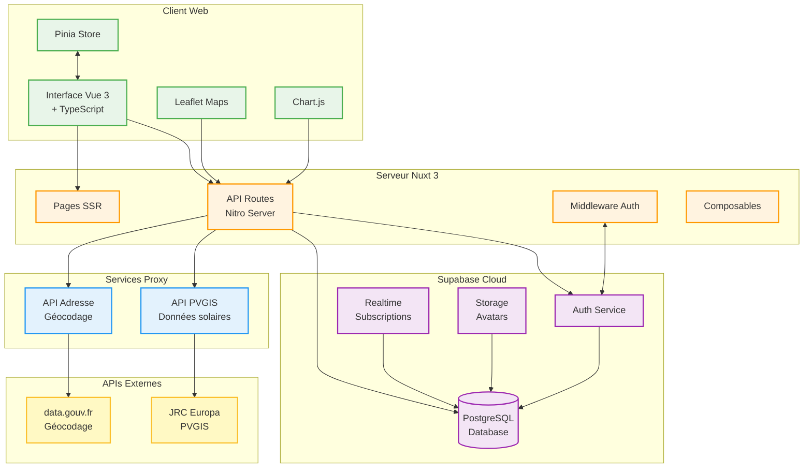
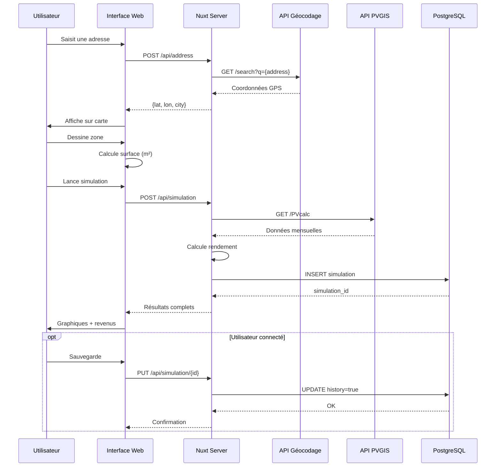
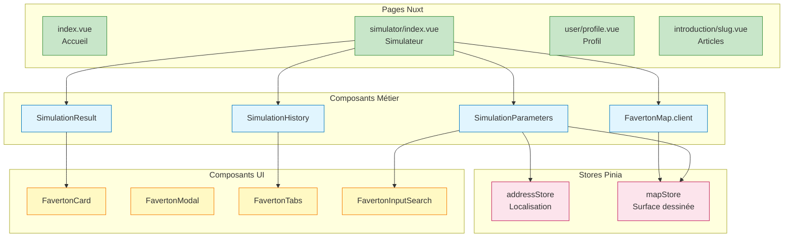

# 🌱 Faverton - Simulateur de Potentiel Solaire pour Fermes Écologiques

## 📌 Introduction

Faverton est un simulateur web permettant d'évaluer le potentiel de production d'énergie solaire pour les exploitations agricoles et les propriétaires terriens. Né de la volonté de démocratiser l'accès aux énergies renouvelables, ce projet s'inscrit dans une démarche de transition écologique en offrant un outil accessible et précis pour estimer la viabilité d'installations photovoltaïques.

### Finalité environnementale

Dans un contexte de transition énergétique, Faverton répond à un besoin concret : permettre aux agriculteurs et propriétaires de prendre des décisions éclairées concernant leurs investissements en énergie solaire. L'application contribue ainsi à accélérer l'adoption des énergies renouvelables dans le secteur agricole.

### Fonctionnalités principales

- **🗺️ Cartographie interactive** : Dessinez directement sur une carte la surface destinée aux panneaux solaires
- **📊 Simulation précise** : Calcul du potentiel énergétique basé sur les données réelles d'ensoleillement (API PVGIS)
- **💰 Estimation financière** : Visualisation des revenus mensuels et annuels potentiels
- **💾 Historique des simulations** : Sauvegarde et comparaison de différents scénarios
- **📱 Interface responsive** : Utilisation optimale sur tous les appareils
- **🔐 Gestion utilisateur** : Authentification sécurisée avec Supabase

## 🏗️ Architecture technique

### Stack technologique et justifications

#### Frontend
- **Nuxt 3** : Framework full-stack choisi pour ses capacités SSR (amélioration du SEO et des performances), son écosystème Vue mature et l'intégration native de TypeScript
- **Vue 3** : Framework réactif avec Composition API pour une meilleure organisation du code
- **TypeScript** : Typage statique garantissant la robustesse du code, particulièrement important pour les calculs de rendement énergétique
- **TailwindCSS & NuxtUI** : Framework CSS utility-first pour un développement rapide et une cohérence visuelle
- **Leaflet** : Bibliothèque de cartographie open-source performante et bien documentée
- **Chart.js** : Visualisation de données avec vue-chartjs pour les graphiques de production
- **TresJS** : Wrapper Vue pour Three.js, utilisé pour les éléments 3D de l'interface

#### Backend
- **Nitro 3** : Serveur intégré à Nuxt 3, optimisé pour les performances avec HMR (Hot Module Replacement)
- **Supabase** : BaaS (Backend-as-a-Service) choisi pour :
  - Authentification intégrée conforme aux standards de sécurité
  - Base de données PostgreSQL robuste
  - API temps réel pour les mises à jour instantanées
  - Interface d'administration simplifiée

#### APIs externes
- **[API Adresse data.gouv.fr](https://geoservices.ign.fr/documentation/services/services-geoplateforme/geocodage)** : Géocodage gouvernemental fiable et gratuit
- **[API PVGIS JRC Europa](https://joint-research-centre.ec.europa.eu/photovoltaic-geographical-information-system-pvgis/getting-started-pvgis_en)** : Données scientifiques validées sur l'ensoleillement européen

### Diagramme d'architecture



Pour une vue plus détaillée des flux de données, voici un second diagramme focalisé sur le parcours d'une simulation :

### Flux de simulation



Et pour compléter, un diagramme de l'organisation des composants Vue :

### Architecture des composants Frontend



## 🚀 Guide d'installation

### Prérequis système

- **Node.js** : v18.0.0 ou supérieur (recommandé : v20.x LTS)
- **pnpm** : v8.0.0 ou supérieur
- **Git** : v2.25.0 ou supérieur
- **PostgreSQL** : v14.0 ou supérieur (si installation locale)

### Installation pas à pas

1. **Cloner le repository**
   ```bash
   git clone git@github.com:Huor97/faverton-app.git
   cd faverton-nuxt3
   ```

Installer les dépendances
```bash
 pnpm install
```

Configuration de l'environnement

 Créer un fichier .env à la racine du projet :
```bash
 cp .env.example .env
```

Configurer les variables d'environnement (voir section suivante)


Lancer le serveur de développement

 pnpm run dev
 L'application sera accessible sur http://localhost:3000


### 🔧 Configuration et variables d'environnement
Variables requises Créez un fichier .env avec les variables suivantes :
```bash
# ===== Configuration Supabase =====
# URL de votre instance Supabase (obtenue depuis le dashboard Supabase)
NUXT_PUBLIC_SUPABASE_URL=https://votre-projet.supabase.co

# Clé anonyme publique pour l'accès côté client
NUXT_PUBLIC_SUPABASE_ANON_KEY=eyJhbGciOiJIUzI1NiIsInR5cCI6IkpXVCJ9...

# Clé de service pour les opérations côté serveur (garder secrète!)
SUPABASE_SERVICE_ROLE_KEY=eyJhbGciOiJIUzI1NiIsInR5cCI6IkpXVCJ9...

# ===== Configuration APIs externes =====
# Endpoint de l'API JRC pour les données solaires
JRC_API_ENDPOINT=https://re.jrc.ec.europa.eu/api/v5_3/PVcalc

# API de géocodage (nouvelle version)
GEOCODING_API_URL=https://data.geopf.fr/geocodage/search

# ===== Configuration application =====
# Mode de l'application (development, production)
NODE_ENV=development

# URL de base de l'application
NUXT_PUBLIC_APP_URL=http://localhost:3000

# ===== Configuration optionnelle =====
# Cloudinary pour l'optimisation d'images (optionnel)
CLOUDINARY_CLOUD_NAME=votre-cloud-name
```

### Obtenir les clés Supabase
1. Créez un compte sur supabase.com
2. Créez un nouveau projet
3. Dans Settings > API, copiez :
- `URL → NUXT_PUBLIC_SUPABASE_URL`
- `anon public → NUXT_PUBLIC_SUPABASE_ANON_KEY`
- `service_role → SUPABASE_SERVICE_ROLE_KEY`

## 📦 Déploiement
### Déploiement local (production)
```bash
# Build de l'application
pnpm run build
```
```bash
# Preview local du build de production
pnpm run preview
```

### Déploiement avec Docker
```bash
# Build de l'image Docker
docker build -t faverton-app .
```
```bash
# Lancer le conteneur
docker run -p 3000:3000 \
  -e NUXT_PUBLIC_SUPABASE_URL=your_url \
  -e NUXT_PUBLIC_SUPABASE_ANON_KEY=your_key \
  faverton-app
```

#### Configuration Docker multi-stage
Le Dockerfile utilise une approche multi-stage pour optimiser la taille de l'image :
```bash
# Stage 1: Dependencies
FROM node:18-alpine AS deps
RUN npm i -g pnpm
WORKDIR /app
COPY package.json pnpm-lock.yaml ./
RUN pnpm install --frozen-lockfile
```

```bash
# Stage 2: Build
FROM node:18-alpine AS builder
RUN npm i -g pnpm
WORKDIR /app
COPY . .
COPY --from=deps /app/node_modules ./node_modules
RUN pnpm build
```

```bash
# Stage 3: Production
FROM node:18-alpine AS runner
WORKDIR /app
COPY --from=builder /app/.output ./.output
EXPOSE 3000
CMD ["node", ".output/server/index.mjs"]
```

### Déploiement sur Vercel (recommandé)
1. Connectez votre repository GitHub à Vercel
2. Configurez les variables d'environnement dans le dashboard Vercel
3. Déploiement automatique à chaque push sur `main`

### Déploiement statique (SSG)
Pour générer une version statique :
```bash
pnpm run generate
```
Les fichiers statiques seront dans le dossier `.output/public/`

## 🧪 Tests
```bash
# Lancer les tests unitaires
pnpm run test
```
```bash
# Lancer les tests avec coverage
pnpm run test:coverage
```
```bash
# Tests en mode watch
pnpm run test:watch
```

## 📚 Documentation

- Documentation technique complète : `/docs`
- Documentation API : Commentaires inline dans `/server/api/`
- Types TypeScript : `/app/types/` et `/server/types/`

## 🛣️ Roadmap
### Phase 1 - MVP (✅ Complété)
- [x] Architecture Nuxt 3 avec TypeScript
- [x] Intégration API JRC Europa
- [x] Cartographie interactive avec Leaflet
- [x] Calculs de rendement énergétique
- [x] Authentification Supabase
- [x] Historique des simulations
- [x] Interface responsive
### Phase 2 - Optimisations (🔄 En cours)
- [ ] Tests unitaires complets
- [ ] Optimisation des performances
- [ ] Mode hors ligne (PWA)
- [ ] Export PDF des résultats
### Phase 3 - Fonctionnalités avancées (🎯 Planifié)
- [ ] Comparaison multi-scénarios
- [ ] Prise en compte de l'ombrage
- [ ] Types de panneaux étendus
- [ ] API publique

## 📄 Licence
Ce projet est sous licence MIT.

## 📨 Contact
- Email : karimi.rouh@proton.me
- GitHub : @Huor97
- LinkedIn : rouh.karimi

Développé avec 💚 pour la transition écologique

## Licence
This software is published under the [MIT License](./faverton-nuxt3/LICENSE).